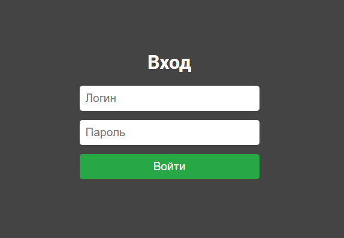
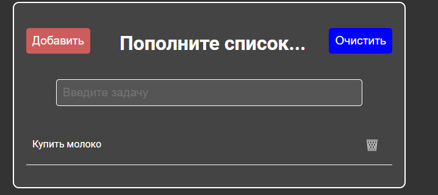

# To-do List Application

Это приложение To-do List, разработанное с использованием React, Redux Toolkit и TypeScript. Пользователи могут добавлять, удалять и очищать задачи, а также выполнять вход в систему с помощью простого интерфейса. 



## Функциональность

- **Добавление задачи**: Пользователь может ввести текст задачи и нажать кнопку "Добавить", чтобы добавить задачу в список.
- **Удаление задачи**: Каждая задача имеет кнопку удаления, которая позволяет удалять конкретную задачу из списка.
- **Очистка всех задач**: Кнопка "Очистить" позволяет удалить все задачи сразу.
- **Авторизация**: Пользователь может войти в приложение, используя логин `admin` и пароль `admin`. После авторизации пользователь остаётся в системе даже после перезагрузки страницы.




## Установка и запуск

1. Склонируйте репозиторий:
   ```bash
   git clone <URL_репозитория>
   cd todo

Установите зависимости:
npm install

Запустите приложение:
npm start

Появиться страница авторизации, необходимо ввести данные.

Логин: admin
Пароль: admin

Используемые технологии
React: Библиотека для создания пользовательских интерфейсов.
Redux Toolkit: Инструмент для управления состоянием приложения.
TypeScript: Язык программирования, расширяющий JavaScript с типизацией.
CSS: Для стилизации компонентов.
Настройка Redux

В этом приложении используется Redux Toolkit для управления состоянием задач. Основные действия и редьюсеры находятся в todoSlice.ts.

Основные действия:
addTodo: Добавляет новую задачу в список.
removeTodo: Удаляет задачу по идентификатору.
clearTodos: Удаляет все задачи из списка.
